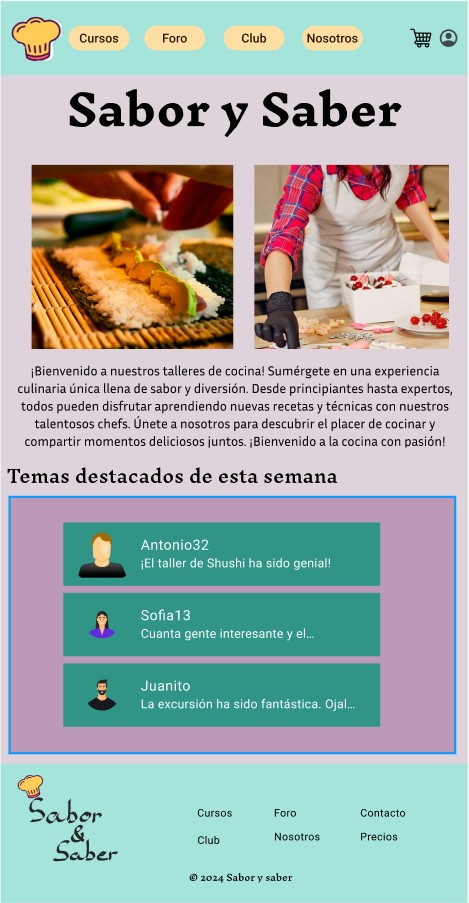
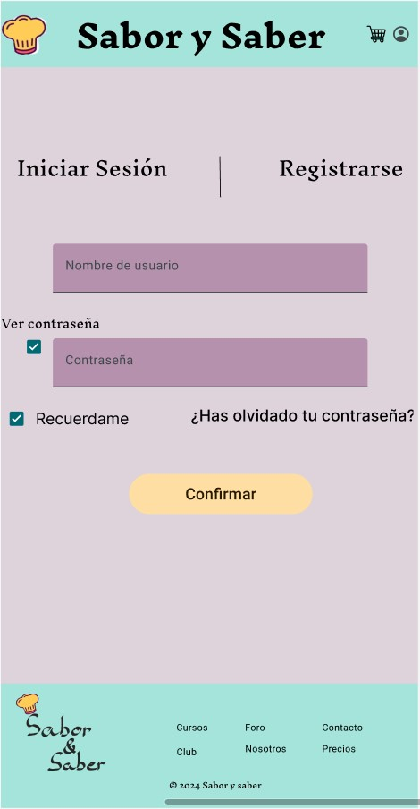
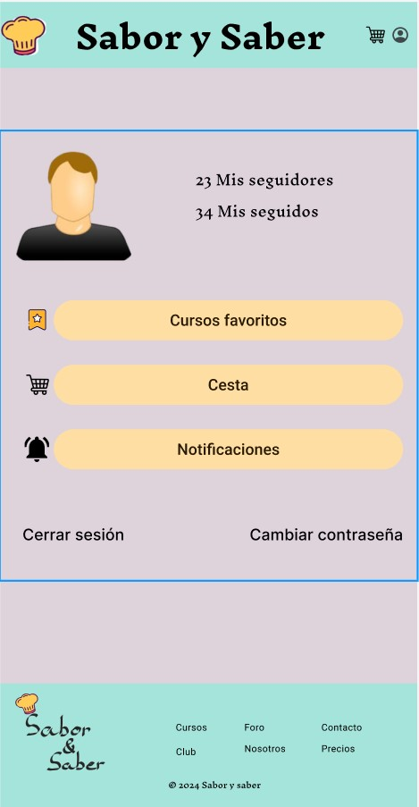
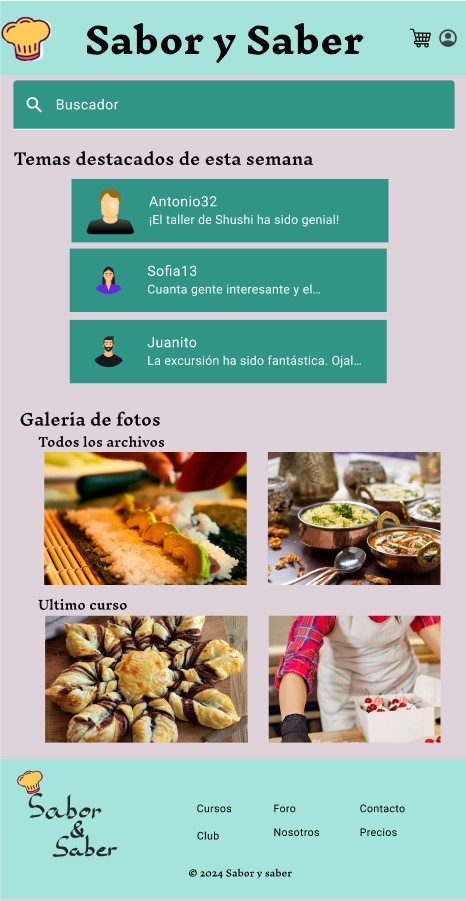

# DIU - Practica 3, entregables

## Moodboard (diseño visual + logotipo)   
Hemos creado un tablón inspiracional dónde hemos recogido ideas para realizar el estilo visual de nuestra aplicación Sabor y Saber.
En él, hemos definido el logo de nuestra aplicación sobre el fondo de los dos colores predominantes, nuestra tipografía que consta de dos funtes diferentes y 4 tamaños según el tipo de texto que sea, una paleta de colores, un labeling de iconos y varias fotos de inspiración.

## Landing Page
Buscamos una presentación de nuestro proyecto de una manera atractiva para el usuario. Para ello, nos hemos ayudado de la herramienta [Webflow](https://webflow.com/). Se puede visualizar comodamente a través de este [enlace](https://pagina-principal-1403fc.webflow.io/).

Nuestra landing page cuenta con una cabecera con el logotipo de nuestra empresa y un menu de navgación por las diferentes secciones de nuestra página web, a parte de un apartado para la cuenta del usuario y su cesta.
El body de cuenta con una imagen inspiradora y un botón de descarga de nuestra aplicación para dispositivos móviñles, a parte de una pequeña introducción.
Finalmente tenemos un pie de página con nuestro logotipo al completo y enlacens de interés para el cliente.

## Guidelines Utilizados

### Página Principal
La página principal presenta un header con botones de navegación y acceso al inicio de sesión y perfil del usuario. En el body, hay un carrousel de imágenes destacadas de cursos y una lista de temas destacados del foro.

### Inicio de Sesión y Registro
En la sección de inicio de sesión y registro, el header es similar al de la página principal. El body contiene campos para nombre de usuario y contraseña, opciones para ver la contraseña y recordar sesión, y un botón para recuperar contraseña.

### Cuenta
La cuenta tiene un header idéntico al de inicio de sesión y registro. El body incluye botones para ver seguidores, seguidos, cursos favoritos, cesta, notificaciones, cerrar sesión y cambiar contraseña.

### Foro
Para el foro, el header es similar al de inicio de sesión y registro. El body cuenta con un buscador, lista de temas del foro y carrousels de fotos del último curso y multimedia de todos los cursos.

### Curso
En cuanto al curso, el header es similar al de inicio de sesión y registro. En el body, hay un date picker para ver disponibilidad de cursos en fechas específicas.

Los elementos no especificados no son patrones IU o guidelines sino imágenes y cuadros de texto.

## Mockup: LAYOUT HI-FI
Hemos desarrolado los bocetos realizados en la práctica anterior para dar forma a nuestra web. En esta carpeta se encuentra el archivo figma para poder verlos.

### Interacciones
- En la página principal podemos pulsar el icono de arriba a la derecha para acceder a tu cuenta y podemos pulsar tambien en el foro para acceder al mismo. Finalmente es posible hacer scroll al carrusel de fotos de izquierda a derecha.
- En el inicio de sesión y registro puedes pulsar los checkbox y los campos de texto, y el boton de confirmar te manda a la pagina con la información de tu cuenta.
- En el foro puedes pulsar la search bar y hacer scroll en ambos carruseles al igual que en la página principal. Si pulsas en el texto de "último curso" podrás acceder al mismo para informarte y ver próximas fechas.

- En todas las páginas puedes hacer scroll en vertical para poder visualizar la página de manera completa y si pulsas en el logotipo del header podrás volver a la página principal desde cualquier otra página.

### Página Principal

### Inicio de Sesión y Registro

### Cuenta

### Foro

### Curso

## Documentación: Publicación del Case Study
En conclusión, hemos conseguido darle forma a nuestra web. Esta ha sido una tarea algo laboriosa que nos ha llevado bastante esfuerzo y tiempo realizar, aunque finalmente hemos obtenido un buen resultado. Es primordial seguir los pasos de investigación indicados para su ejecución para obtener un correcto trabajo.

