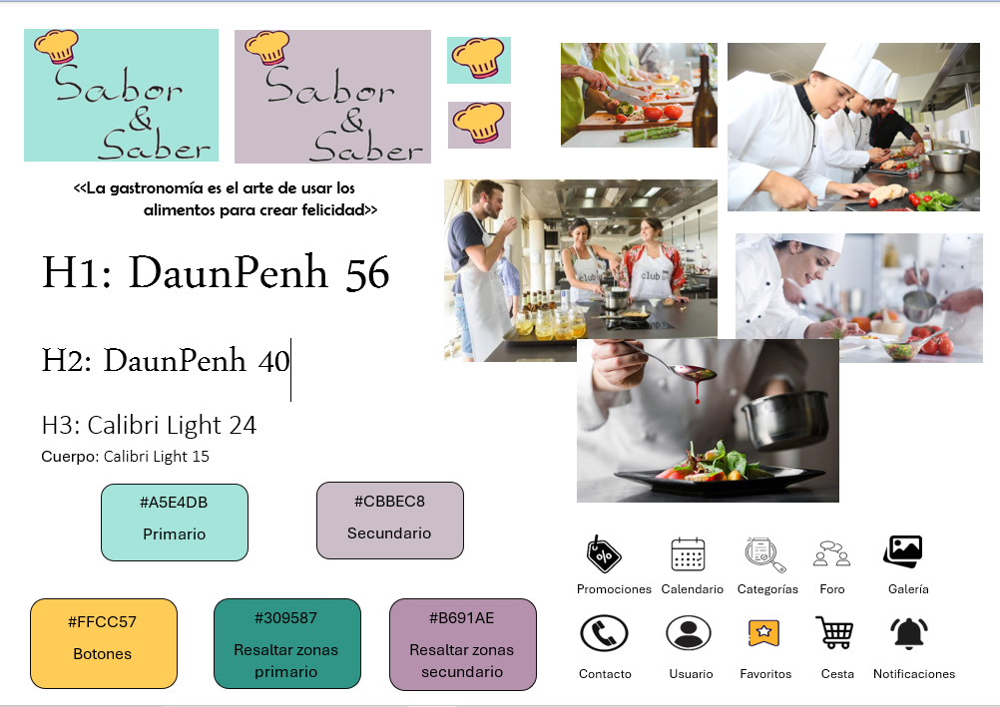

# DIU - Practica 3, entregables

## Moodboard (diseño visual + logotipo)   
Hemos creado un tablón inspiracional dónde hemos recogido ideas para realizar el estilo visual de nuestra aplicación Sabor y Saber.
En él, hemos definido el logo de nuestra aplicación sobre el fondo de los dos colores predominantes, nuestra tipografía que consta de dos funtes diferentes y 4 tamaños según el tipo de texto que sea, una paleta de colores, un labeling de iconos y varias fotos de inspiración.

## Landing Page
Buscamos una presentación de nuestro proyecto de una manera atractiva para el usuario. Para ello, nos hemos ayudado de la herramienta [Webflow](https://webflow.com/). Se puede visualizar comodamente a través de este [enlace](https://pagina-principal-1403fc.webflow.io/).

Nuestra landing page cuenta con una cabecera con el logotipo de nuestra empresa y un menu de navgación por las diferentes secciones de nuestra página web, a parte de un apartado para la cuenta del usuario y su cesta.
El body de cuenta con una imagen inspiradora y un botón de descarga de nuestra aplicación para dispositivos móviñles, a parte de una pequeña introducción.
Finalmente tenemos un pie de página con nuestro logotipo al completo y enlacens de interés para el cliente.

## Mockup: LAYOUT HI-FI

## Documentación: Publicación del Case Study

(incluye) Valoración del equipo sobre la realización de esta práctica o los problemas surgidos
 
